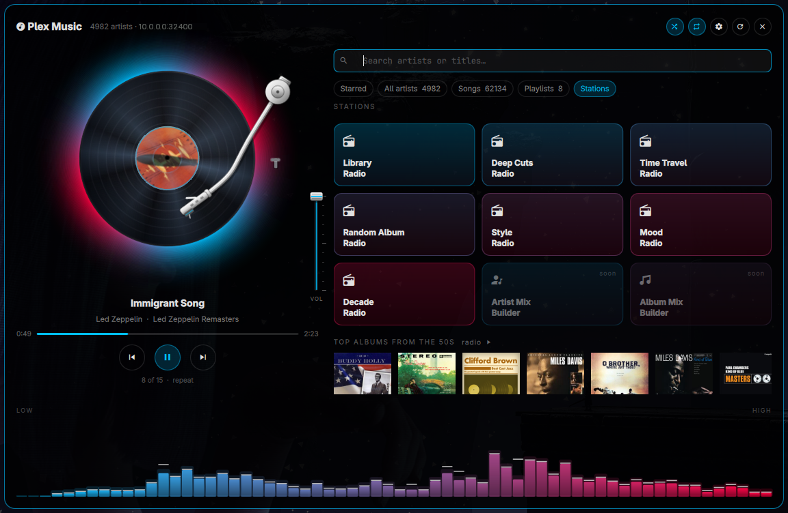
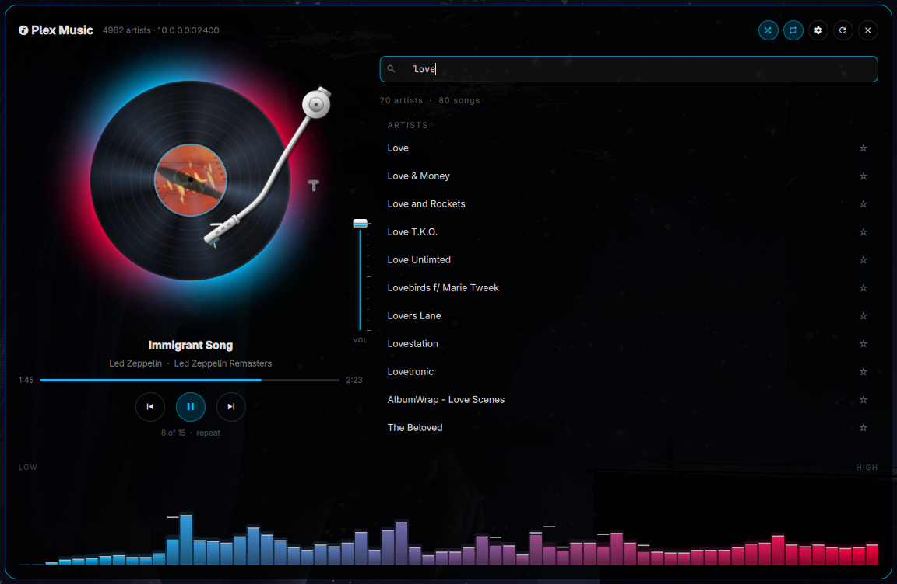
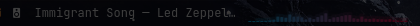

# Plex Music

Play your own music library from the Omarchy bar.

A turntable with the real album cover on the label, a full-width spectrum
analyser in your theme's colours, your starred artists one click away, the
whole library browsable A–Z, and type-to-search across all of it. A small live
meter sits beside the track in the bar while music plays. Tracks come straight
off your Plex server through mpv — direct play, no transcode, no Plex Pass,
nothing via the cloud.


| Stations | Search |
| --- | --- |
|  |  |

In the bar: 

## What is in the panel

- **Starred** — the artists you keep. Star any artist to add them.
- **All artists** — the whole library A–Z with a jump strip.
- **Playlists** — your Plex playlists (the real ones; they show up in every
  other Plex app).
- **Stations** — radio built from your own library the way Plexamp does it:
  Library Radio, Deep Cuts (tracks you have never played), Time Travel (every
  decade at once), Random Album, Style, Mood and Decade Radio, plus rows of
  top albums per decade. Each station is built from the server the moment you
  press it, so anything you add to Plex is in it straight away.
- The index of artists and songs rebuilds itself whenever Plex reports the
  library was scanned after the index was built — no manual rescan needed.
- Open an artist for their **albums** (covers, years), an album for its
  **tracks**. Every row has play; clicking a track plays the album from there.
- Click the **now-playing line** under the record (title, or artist · album) to jump
  to that album, whatever you were browsing — handy after playing a single song or a
  station. With no album known it opens the artist instead.
- The **+** on a track, an album, or "Add all" opens *Add to playlist*: pick an
  existing playlist or type a name to start a new one. The plugin only ever
  adds — it never removes tracks or deletes playlists.

Keyboard, with the cursor in the search box the whole time:

| Key | Does |
| --- | --- |
| type | search artists |
| ↑ ↓ / PgUp PgDn | move the highlight |
| Enter | open the highlighted row (artist → albums → tracks); on a track, play from it |
| Ctrl+Enter | play the highlighted row |
| ← / Backspace (empty box) | back |
| Ctrl+P | add the highlighted track or album to a playlist |
| Ctrl+L | repeat on/off — start again when the album, playlist or queue ends |
| Ctrl+G | go to what is playing: its album opens on the right (same as clicking the now-playing line) |
| Ctrl+1 … Ctrl+5 | Starred · All artists · Songs · Playlists · Stations |
| Esc | close the popup, clear the search, go back, then close the panel |

## Why this rather than the other Plex plugins

The Plex plugins on the marketplace either monitor the server or play video.
This one is for a music library you already own: a list of the artists you
actually reach for, a search box over everything else, and one click to play.

## Requirements

- [Omarchy](https://omarchy.org/) (Quattro / shell plugins)
- A Plex Media Server with a music library
- `python3` — runs the `bin/plexmusic` helper (standard library only)
- `xdg-open` — opens plex.tv/link in your browser when linking (part of `xdg-utils`)
- `mpv` — the player
- `mpv-mpris` — so the rest of the desktop sees what is playing (optional)
- `cava` — the spectrum analyser (optional; without it the band says "idle")

```bash
sudo pacman -S mpv mpv-mpris cava
```

## Install

```bash
omarchy plugin add https://github.com/mfilm77/omarchy-plexmusic.git --enable
```

Then click the widget and link your Plex account: it shows a four-character
code, you type it at [plex.tv/link](https://plex.tv/link), done.

## Remove

```bash
omarchy plugin remove io.github.mfilm77.plexmusic
```

To disable it but keep the files:

```bash
omarchy plugin disable io.github.mfilm77.plexmusic
```

## Settings

The gear in the panel header (or **Ctrl+,**) opens Settings:

- **Account** — who is linked, and *Unlink* (two clicks; wipes the token and
  the local index).
- **Server** — every address plex.tv reports for your account, probed live
  with round-trip times, the one in use marked. Click another to switch. Type
  your own to add and use it — a LAN name, a reverse proxy, or a VPN address
  such as Tailscale's. Typed addresses are tried before anything else and can be
  forgotten again with the ×.
- **Music library** — shown when the server has more than one; switching
  rebuilds the index.
- **Index** — artist count and a Rescan button.

No VPN is needed. If your server is on the same network the local address is
found; away from home, Plex's Remote Access address is used if you have it
enabled, and Plex's relay is the last resort.

## How it finds your server

In this order:

1. **Addresses you added yourself.** This is the one that matters if your server
   is only reachable over a VPN — Plex does not advertise a Tailscale or
   WireGuard address, so you tell the plugin about it:

   ```bash
   .../bin/plexmusic server --add http://100.64.0.10:32400
   ```

2. **Whatever plex.tv reports** for your account — local addresses first, then
   remote, with Plex's relay last because it is slow.

Every candidate is probed before use, so a laptop that moves between the LAN and
a VPN picks the reachable one each time without being told. `plexmusic server`
lists them all with round-trip times.

## Your credentials

- Linking uses the **plex.tv PIN flow**: your password is typed into Plex's own
  site, never into this plugin. Plex hands back a token.
- That token is written to `~/.config/omarchy-plex-music/auth.json`, mode
  `0600`, on the machine you linked. It is never sent anywhere but your own
  Plex server.
- `plexmusic link forget` deletes the token, the server settings and the cached
  index. It keeps your starred artists (`favourites.json`, which holds no
  token) and the cover cache, so relinking brings your list straight back.
- Nothing credential-shaped is in this repository, and the files that hold a
  token are in `.gitignore`.

Two files are also `0600` because they embed the token in stream URLs: the
generated queue (`~/.local/share/omarchy-plex-music/queue.m3u`) and its metadata.

## Keyboard shortcuts and macropads

Bind keys straight to the helper — it needs no running shell:

```bash
.../plugins/io.github.mfilm77.plexmusic/bin/plexmusic cmd play-pause
.../plugins/io.github.mfilm77.plexmusic/bin/plexmusic cmd next
```

Middle-clicking the bar widget also toggles play/pause without opening anything.

## The helper on its own

`bin/plexmusic` is a plain Python script that prints JSON, so it is usable and
testable without the shell:

| Command | What it does |
| --- | --- |
| `link start` / `link poll` | the plex.tv code flow |
| `link forget` | delete the token and all local state |
| `server` / `server --add URL` | list or add server addresses |
| `index` | build the artist index (a few seconds for thousands of artists) |
| `search QUERY` | match artists, accent- and case-insensitively |
| `favourites list\|add\|remove\|move` | the starred list |
| `albums --artist KEY` | an artist's albums, newest first |
| `tracks --album KEY` / `--playlist KEY` / `--artist KEY` | track listings |
| `playlists list` / `create --title T --tracks k1,k2` / `add --key P --tracks k1,k2` | Plex playlists (add-only, never delete) |
| `play --key ARTIST` / `--album KEY` / `--playlist KEY` / `--tracks k1,k2` `[--start-at K] [--shuffle]` | play |
| `cmd play-pause\|next\|prev\|stop\|volume` | transport |
| `now` | what is playing, with the cached cover's path |
| `art THUMB` | cache a cover and print its local path |

`PLEXMUSIC_MPV_ARGS` is passed through to mpv, for picking an output device or
changing the replaygain mode.

## How it works

- **Artists** are indexed once into `~/.local/share/omarchy-plex-music`. The
  panel loads that file into memory and searches it in QML, so typing never
  waits on a process; the A–Z list is a virtualised view over the same array,
  so thousands of artists scroll and jump without loading anything. The index
  is in Plex's own sort order, which files "The Beatles" under B.
- **Bar widget settings**: `showTrack`, `maxTrackChars`, `showMeter` and
  `meterBars` (the bar meter folds the 64 cava bands down to that many; the
  panel always shows all 64). The bar meter only appears while music is
  sounding, and cava only runs then or while the panel is open.
- **Playback** is an m3u of direct-play URLs handed to mpv, which is controlled
  over an IPC socket. ReplayGain is on, which evens out a library ripped over
  twenty years; it is a no-op on files with no tags.
- **The current track** is found by matching mpv's path back to the queue, not
  by playlist index, so it stays correct when shuffle reorders things.
- **Covers** come from Plex's own photo transcoder (500 px on the turntable,
  smaller in the lists) and are cached in `~/.cache/omarchy-plex-music/art`,
  owner-only. The panel only ever loads covers from that cache, so no URL
  carrying your token reaches the shell or its log. The cache key includes Plex's artwork
  version, so replacing a cover in Plex does not leave a stale one here.
- **The record** turns at 33⅓ rpm — 1.8 s a revolution. Pausing stops it where
  it is. The tonearm's pivot and length are solved so the stylus lands on the
  outermost groove for the first track of what is playing and reaches the
  label for the last, creeping inward per song; its rest sits just off the edge
  by the lead-in, so cueing is a lift and a few degrees, never a sweep across
  the record.
- **Shuffle** and **Repeat** are the two toggles in the header. Repeat applies to
  the queue that is playing and to the next one you start.
- **Timeline** — click or drag to seek. **Volume** is a small console fader at
  the deck's right edge (drag, or scroll over it).
- **The meters** are `cava` in raw mode, read a frame at a time. cava taps the
  default output's monitor, so the band follows whatever the machine is playing
  and keeps working when you switch to headphones. It only runs while the panel
  is open.
- **Colours** are read from the active Omarchy theme — quiet passages in the
  accent colour, peaks in the urgent colour, caps in the foreground colour. No
  hardcoded palette.

## Non-obvious bits

- **Mangled characters in artist names.** Plex hands back whatever bytes are in
  the file tags, and an old library has tags that are not valid UTF-8. Those
  bytes are replaced rather than allowed to fail the whole index.
- **Editing an open panel.** Omarchy hot-reloads a changed plugin, but a panel
  that has already been opened keeps its compiled instance until the shell is
  restarted (`omarchy-restart-shell` — *not* `omarchy-refresh-shell`, which
  resets your whole bar layout). Bar widgets and the service do reload live.
- **Play counts are not used.** On a large library Plex can report an identical
  `viewCount` for every artist, which makes "most played" meaningless. The
  starred list is curated by you for that reason.

## Changes

[CHANGELOG.md](CHANGELOG.md). The short version of 0.2.0: a first run that
linked the account before adding the server used to end with an empty library
and no explanation, and a rescan of a large library gave no sign it was
running — both fixed, with the reason always shown now. It also carries the two
fixes from the marketplace security review (safe, no-follow, atomic writes for
everything including the token file, and a byte cap on every reply from the
server), the tap-to-open-the-playing-album addition, and the fix for the record
that stopped turning while the music played.

## License

MIT. See [LICENSE](LICENSE).
